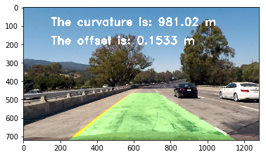

## Advanced Lane Finding
The goals / steps of this project are the following:
•	Compute the camera calibration matrix and distortion coefficients given a set of chessboard images.
•	Apply a distortion correction to raw images.
•	Use color transforms, gradients, etc., to create a thresholded binary image.
•	Apply a perspective transform to rectify binary image ("birds-eye view").
•	Detect lane pixels and fit to find the lane boundary.
•	Determine the curvature of the lane and vehicle position with respect to center.
•	Warp the detected lane boundaries back onto the original image.
•	Output visual display of the lane boundaries and numerical estimation of lane curvature and vehicle position.

Test Images Pipeline
---
Camera Calibration 
The camera images need to be calibrated due to the camera distortion.  Chessboard images are employed to do the distortion calibration.
First, opencv findChessboradCorners function is used to find all the corners of chessboard images, Figure 1 shows two examples of the chessboard with corner drawing on top.

Distortion correction
With the corner points and object points (Manually choose the object points), we apply opencv calibrateCamera function to find the distortion coefficients and do the distortion calibration.  One distortion-corrected image is shown in Figure 2.

Color and Gradient Threshold
Once distortion corrected coefficients are calculated, applying distortion correction on all the lane line images.  After distortion correction, next step is to apply threshold value to acquire binary images with the lane line information.
I apply two threshold methods to find the lane line: color and gradient threshold.  
For the color threshold method, RGB images are converted to the HLS images.  The S channel has the best performance to find the lane line among other color channels. The threshold for the color filter is set from 170 to 255.
For the gradient threshold method, sobel x value is calculated to find the lane line information.  The kernel size is equal to 5 and the threshold is set from 40 to 150.
Last step is to combine the binary images from color threshold and gradient threshold method, and the results are shown below:

Perspective transform
The binary images with lane line information can’t be used to calculate the curvature directly.  Due to the image depth problem (The lane line looks like interrupt each other in the far field), perspective transform need to be performed before fitting the lane line.  
For the transform, choosing four points on the lane line as the source points, and set a rectangle shape with four destiny points.  The source and destiny points are shown in the table below.
Source points	(189, 720)	(572, 464)	(711, 464)	(1102, 720)
Destiny points	(320, 720)	(320, 0)	(950, 0)	(950, 720)
Applying opencv function getPerspectiveTransform to calculate the perspective transform coefficients.  With the coefficients, performing the perspective transform on the binary lane line images, the results are shown below:

Sliding Window to find the lane line
After perspective transform, lane line points can be accurately fitted.  I use sliding window method to find the lane line points and do the poly fit for the lane line. The window margin size is 40, the total number of windows is nine.  Sliding windows shift from bottom to the top of the binary images for both left and right lane lines.  Based on the minipoints value, shifting the center of the window left and right to fit the lane line better.  After found all the useful points for the left and right lane lines, we apply poly fit to find the fitting coefficients of left and right lane lines.  The fitted lane lines are shown in the below:

Curvature and offset value calculation
With the fitted curve information and the math equation below, we can calculate the curvature of the lane line.
R_curve=  〖(1+〖(2Ay+B)〗^2)〗^(3/2)/(|2A|)
The offset value is calculated based on the difference between the middle point of the real image and the middle point between two fitted lane lines.
The results are shown below:

